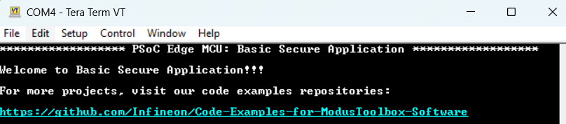
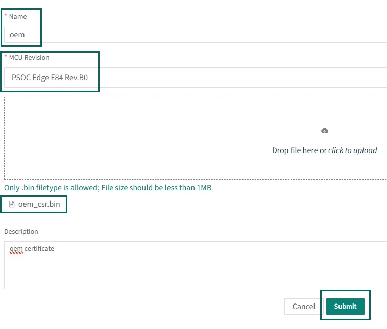

# PSOC&trade; Edge MCU: Basic secure application

This code example is designed to guide you through the project-signing process (of *proj_cm33_s*) in the application to demonstrate how to extend the root of trust to the first user project (*proj_cm33_s*) from the extended boot.

This code example has a three project structure: CM33 secure, CM33 non-secure, and CM55 projects. All three projects are programmed to the external QSPI flash and executed in Execute in Place (XIP) mode. Extended boot launches the CM33 secure project from a fixed location in the external flash, which then configures the protection settings and launches the CM33 non-secure application. Additionally, CM33 non-secure application enables CM55 CPU and launches the CM55 application.

[View this README on GitHub.](https://github.com/Infineon/mtb-example-psoc-edge-basic-secure-app)

[Provide feedback on this code example.](https://cypress.co1.qualtrics.com/jfe/form/SV_1NTns53sK2yiljn?Q_EED=eyJVbmlxdWUgRG9jIElkIjoiQ0UyMzg1MzciLCJTcGVjIE51bWJlciI6IjAwMi0zODUzNyIsIkRvYyBUaXRsZSI6IlBTT0MmdHJhZGU7IEVkZ2UgTUNVOiBCYXNpYyBzZWN1cmUgYXBwbGljYXRpb24iLCJyaWQiOiJ2YXN1bWEgbmFyYXlhbmEiLCJEb2MgdmVyc2lvbiI6IjIuMC4wIiwiRG9jIExhbmd1YWdlIjoiRW5nbGlzaCIsIkRvYyBEaXZpc2lvbiI6Ik1DRCIsIkRvYyBCVSI6IklDVyIsIkRvYyBGYW1pbHkiOiJQU09DIn0=)

See the [Design and implementation](docs/design_and_implementation.md) for the functional description of this code example.


## Requirements

- [ModusToolbox&trade;](https://www.infineon.com/modustoolbox) v3.6 or later (tested with v3.6)
- Board support package (BSP) minimum required version for:
   - KIT_PSE84_EVAL_EPC2: v1.0.0
   - KIT_PSE84_EVAL_EPC4: v1.0.0
- Programming language: C
- Associated parts: All [PSOC&trade; Edge E84 MCU](https://www.infineon.com/products/microcontroller/32-bit-psoc-arm-cortex/32-bit-psoc-edge-arm/psoc-edge-e84) parts


## Supported toolchains (make variable 'TOOLCHAIN')

- GNU Arm&reg; Embedded Compiler v14.2.1 (`GCC_ARM`) – Default value of `TOOLCHAIN`
- Arm&reg; Compiler v6.22 (`ARM`)
- IAR C/C++ Compiler v9.50.2 (`IAR`)
- LLVM Embedded Toolchain for Arm&reg; v19.1.5 (`LLVM_ARM`)


## Supported kits (make variable 'TARGET')

- [PSOC&trade; Edge E84 Evaluation Kit](https://www.infineon.com/KIT_PSE84_EVAL) (`KIT_PSE84_EVAL_EPC2`) – Default value of `TARGET`
- [PSOC&trade; Edge E84 Evaluation Kit](https://www.infineon.com/KIT_PSE84_EVAL) (`KIT_PSE84_EVAL_EPC4`)


## Hardware setup

This example uses the board's default configuration. See the kit user guide to ensure that the board is configured correctly.

Ensure the following jumper and pin configuration on board.
- BOOT SW must be in the HIGH/ON position
- J20 and J21 must be in the tristate/not connected (NC) position


## Software setup

See the [ModusToolbox&trade; tools package installation guide](https://www.infineon.com/ModusToolboxInstallguide) for information about installing and configuring the tools package.

Install a terminal emulator if you do not have one. Instructions in this document use [Tera Term](https://teratermproject.github.io/index-en.html).

This example requires no additional software or tools.


## Operation

See [Using the code example](docs/using_the_code_example.md) for instructions on creating a project, opening it in various supported IDEs, and performing tasks, such as building, programming, and debugging the application within the respective IDEs.

1. Connect the board to your PC using the provided USB cable through the KitProg3 USB connector

2. Open a terminal program and select the KitProg3 COM port. Set the serial port parameters to 8N1 and 115200 baud

3. After programming, the application starts automatically. Confirm that "PSOC Edge MCU: Basic Secure Application" is displayed on the UART terminal

   **Figure 1. Terminal output on program startup**

   

4. Confirm that the kit User LED1 blinks at approximately 1 Hz


### Steps to enable secure boot flow 

**Prerequisite**

Infineon’s Edge Protect Tools is a set of command line tools used to perform the functions needed for key signing, key generation, OEM certificate creation, device provisioning, and so on. These tools are executed through a shell tool. **Edge Protect Tools** executable is available in the **Edge Protect Security Suite v1.6**, located in the *C:/Users/\<username>/Infineon/Tools/ModusToolbox-Edge-Protect-Security-Suite-1.6/tools/edgeprotecttools/bin/* directory.

Add the executable path to the system environment path variable of the host PC.

To use Edge Protect Tools CLI, is recommended to use "modus-shell", which is installed along with ModusToolbox&trade; located in the *ModusToolbox/tools_x.y* directory. 


**Transfer of ownership**

Ownership of the device should be transferred to yourself before changing the policy file. Follow the steps to transfer ownership

1. Open modus-shell and navigate to the application directory

    ```
    cd <app-directory>

    ```

2. Execute the following command to initialize the tools. This is required once after the new version of EAP is installed

    ```
    edgeprotecttools -t pse8xs2 init
    ```

3. Execute the following command to configure the openOCD tools path:

    ```
    edgeprotecttools set-ocd --name openocd --path <openocd_path>
    ```

    > **Note:** Replace <openocd_path> with the path to the openocd directory installed when the Early Access Pack was installed. Typically, this should be *C:/Users/\<username>/ModusToolbox/packs/PSOC-E84-EA/tools/openocd*. Replace the username with your system username

4. Create a private and public key pair. The following command generates one pair of keys that is placed in the keys directory:

    ```
    edgeprotecttools create-key --key-type ECDSA-P256 --output keys/oem_private_key_0.pem keys/oem_public_key_0.pem 
    ```

5. To generate a new CSR, execute this command:

    ```
    edgeprotecttools -t pse8xs2 oem-csr --certificate-name "oem-cert" --oem "Dummy OEM" --project "Dummy Project" --project-number "1234" --public-key-0 keys/oem_public_key_0.pem --cert-type development --output packets/apps/prov_oem/oem_csr.bin --sign-key-0 keys/oem_private_key_0.pem
    ```

6. Submit the generated CSR to **Edge Protect Signing Service** [here](https://osts.infineon.com/) to generate the Infineon-signed OEM certificate and download the generated certificate

    **Figure 2. Submit CSR to generate signed certificate**

    

7. Provision the device with the new key and certificate to transfer the ownserhip

    ```
    edgeprotecttools -t pse8xs2 provision-device -p policy/policy_oem_provisioning.json --key keys/oem_private_key_0.pem --ifx-oem-cert packets/apps/prov_oem/oem_cert.bin
    ```

    > **Note:** See [AN237849](https://www.infineon.com/AN237849) for more details on transfer of ownership.


**Enable secure boot in extended boot**

To enable secure boot in the PSOC&trade; Edge device, provision it with the `secure_boot` flag set to "true" in the OEM policy. 

The OEM policy file (*policy_oem_provisioning.json*) is located in the *[application directory]/policy/* directory, which is created when `edgeprotecttools` is initialized. For `edgeprotecttools` initilization, see Section 2.2.2.1 of "Getting started with PSOC&trade; Edge security".

1. In the OEM policy, set the `extended_boot_policy` > `secure_boot` > `value` to 'true': 

    ```
      "extended_boot_policy": {
        "secure_boot": {
          "description": "Disable/Enable secure boot option",
          "value": true
        }
    ```

2. Once the policy is updated, provision the device with the updated policy

    ```
    edgeprotecttools -t pse8xs2 provision-device -p policy/policy_oem_provisioning.json --key keys/oem_private_key_0.pem
    ```

    For provisioning details, see Section 2.2.2.4 of [AN237849](https://www.infineon.com/AN237849)


**Enable postbuild signing for this example**

Once the device is succesfully provisioned to enable the secure boot feature, extended boot will launch the first user application only if the image signature has been succesfully verified. 

1. To boot the application successfully, sign the first user application (*proj_cm33_s*) with the same key you used for taking the device ownership  

2. To add signature to the *proj_cm33_s* image, add the `COMBINE_SIGN_JSON` in the *common.mk* file of the application and use the *secure_boot_with_extended_boot.json* as the value for the `COMBINE_SIGN_JSON` variable. 

    The *common.mk* file is located in the top-level directory of your application. In this example, it is the *C:/mtb_projects/MySecureApp/* 

    ```
    COMBINE_SIGN_JSON?=configs/secure_boot_with_extended_boot.json
    ```

2. Open the *\<application-directory>/configs/secure_boot_with_extended_boot.json* file to verify the path to OEM_ROT_PRIVATE_KEY is correct

    ```
    "signing-key" :"./../keys/oem_private_key_0.pem"
    ```

    > **Note:** This should be same key that was generated and used for taking the device ownership, see PRE-REQUISITE section. Copy the generated keys to the *\<application-directory>/keys/ folder*

### Generate debug launch configurations from combiner signer JSON file

Combiner Signer JSON file must contain the `extra_config` option to generate debug launch configuration for the signed hex file. All combiner signer JSON files in this code example already contains the required configuration to generate ModusToolbox&trade; launch configurations.

1. Whenever the combiner signer file used in the *common.mk* file is changed, navigate to the application-directory in a terminal window and perform the following step: 

    <details><summary><b>In Eclipse IDE</b></summary> 

      make eclipse

    </details>
    
    <details><summary><b>In other IDEs</b></summary>

      Follow the instructions in your preferred IDE

    </details> <br>
   

### Test secure boot
 
Follow the instructions provided in the **Operation** section and observe the device booting successfully. 


### How this example is different from PSOC&trade; Edge MCU: Hello world

This code example demonstrates how to enable secure boot with extended boot.

Files                                 | Use case
:--------                             | :--------
*boot_with_extended_boot.json*        | Start the application with extended boot itself. MCUboot header is added to *proj_cm33_s* for validation by the extended boot; default out-of-the-box configuration
*secure_boot_with_extended_boot.json* | secure boot of *proj_cm33_s* application using extended boot. MCUboot header and signature is added to *proj_cm33_s* for verification by extended boot
*design.modus*                        | Provided in the *templates* directory of this example. It is configured to be compatible with the EdgeProtect Bootloader (EPB). If you use this example with EPB, see EdgeProtect Bootloader application notes and code example for further details 
<br>


## Related resources

Resources  | Links
-----------|----------------------------------
Application notes  | [AN235935](https://www.infineon.com/AN235935) – Getting started with PSOC&trade; Edge E84 MCU on ModusToolbox&trade; software
Code examples  | [Using ModusToolbox&trade;](https://github.com/Infineon/Code-Examples-for-ModusToolbox-Software) on GitHub
Device documentation | [PSOC&trade; Edge E84 MCU datasheet](https://www.infineon.com/products/microcontroller/32-bit-psoc-arm-cortex/32-bit-psoc-edge-arm#documents) <br> [PSOC&trade; Edge E84 MCU reference manuals](https://www.infineon.com/products/microcontroller/32-bit-psoc-arm-cortex/32-bit-psoc-edge-arm#documents)
Development kits | Select your kits from the [Evaluation board finder](https://www.infineon.com/cms/en/design-support/finder-selection-tools/product-finder/evaluation-board)
Libraries  | [mtb-dsl-pse8xxgp](https://github.com/Infineon/mtb-dsl-pse8xxgp) – Device support library for PSE8XXGP <br> [retarget-io](https://github.com/Infineon/retarget-io) – Utility library to retarget STDIO messages to a UART port
Tools  | [ModusToolbox&trade;](https://www.infineon.com/modustoolbox) – ModusToolbox&trade; software is a collection of easy-to-use libraries and tools enabling rapid development with Infineon MCUs for applications ranging from wireless and cloud-connected systems, edge AI/ML, embedded sense and control, to wired USB connectivity using PSOC&trade; Industrial/IoT MCUs, AIROC&trade; Wi-Fi and Bluetooth&reg; connectivity devices, XMC&trade; Industrial MCUs, and EZ-USB&trade;/EZ-PD&trade; wired connectivity controllers. ModusToolbox&trade; incorporates a comprehensive set of BSPs, HAL, libraries, configuration tools, and provides support for industry-standard IDEs to fast-track your embedded application development

<br>


## Other resources

Infineon provides a wealth of data at [www.infineon.com](https://www.infineon.com) to help you select the right device, and quickly and effectively integrate it into your design.


## Document history

Document title: *CE238537* – *PSOC&trade; Edge MCU: Basic secure application*

 Version | Description of change
 ------- | ---------------------
 1.x.0   | New code example <br> Early access release
 2.0.0   | GitHub release
<br>


All referenced product or service names and trademarks are the property of their respective owners.

The Bluetooth&reg; word mark and logos are registered trademarks owned by Bluetooth SIG, Inc., and any use of such marks by Infineon is under license.

PSOC&trade;, formerly known as PSoC&trade;, is a trademark of Infineon Technologies. Any references to PSoC&trade; in this document or others shall be deemed to refer to PSOC&trade;.

---------------------------------------------------------

© Cypress Semiconductor Corporation, 2025. This document is the property of Cypress Semiconductor Corporation, an Infineon Technologies company, and its affiliates ("Cypress").  This document, including any software or firmware included or referenced in this document ("Software"), is owned by Cypress under the intellectual property laws and treaties of the United States and other countries worldwide.  Cypress reserves all rights under such laws and treaties and does not, except as specifically stated in this paragraph, grant any license under its patents, copyrights, trademarks, or other intellectual property rights.  If the Software is not accompanied by a license agreement and you do not otherwise have a written agreement with Cypress governing the use of the Software, then Cypress hereby grants you a personal, non-exclusive, nontransferable license (without the right to sublicense) (1) under its copyright rights in the Software (a) for Software provided in source code form, to modify and reproduce the Software solely for use with Cypress hardware products, only internally within your organization, and (b) to distribute the Software in binary code form externally to end users (either directly or indirectly through resellers and distributors), solely for use on Cypress hardware product units, and (2) under those claims of Cypress's patents that are infringed by the Software (as provided by Cypress, unmodified) to make, use, distribute, and import the Software solely for use with Cypress hardware products.  Any other use, reproduction, modification, translation, or compilation of the Software is prohibited.
<br>
TO THE EXTENT PERMITTED BY APPLICABLE LAW, CYPRESS MAKES NO WARRANTY OF ANY KIND, EXPRESS OR IMPLIED, WITH REGARD TO THIS DOCUMENT OR ANY SOFTWARE OR ACCOMPANYING HARDWARE, INCLUDING, BUT NOT LIMITED TO, THE IMPLIED WARRANTIES OF MERCHANTABILITY AND FITNESS FOR A PARTICULAR PURPOSE.  No computing device can be absolutely secure.  Therefore, despite security measures implemented in Cypress hardware or software products, Cypress shall have no liability arising out of any security breach, such as unauthorized access to or use of a Cypress product. CYPRESS DOES NOT REPRESENT, WARRANT, OR GUARANTEE THAT CYPRESS PRODUCTS, OR SYSTEMS CREATED USING CYPRESS PRODUCTS, WILL BE FREE FROM CORRUPTION, ATTACK, VIRUSES, INTERFERENCE, HACKING, DATA LOSS OR THEFT, OR OTHER SECURITY INTRUSION (collectively, "Security Breach").  Cypress disclaims any liability relating to any Security Breach, and you shall and hereby do release Cypress from any claim, damage, or other liability arising from any Security Breach.  In addition, the products described in these materials may contain design defects or errors known as errata which may cause the product to deviate from published specifications. To the extent permitted by applicable law, Cypress reserves the right to make changes to this document without further notice. Cypress does not assume any liability arising out of the application or use of any product or circuit described in this document. Any information provided in this document, including any sample design information or programming code, is provided only for reference purposes.  It is the responsibility of the user of this document to properly design, program, and test the functionality and safety of any application made of this information and any resulting product.  "High-Risk Device" means any device or system whose failure could cause personal injury, death, or property damage.  Examples of High-Risk Devices are weapons, nuclear installations, surgical implants, and other medical devices.  "Critical Component" means any component of a High-Risk Device whose failure to perform can be reasonably expected to cause, directly or indirectly, the failure of the High-Risk Device, or to affect its safety or effectiveness.  Cypress is not liable, in whole or in part, and you shall and hereby do release Cypress from any claim, damage, or other liability arising from any use of a Cypress product as a Critical Component in a High-Risk Device. You shall indemnify and hold Cypress, including its affiliates, and its directors, officers, employees, agents, distributors, and assigns harmless from and against all claims, costs, damages, and expenses, arising out of any claim, including claims for product liability, personal injury or death, or property damage arising from any use of a Cypress product as a Critical Component in a High-Risk Device. Cypress products are not intended or authorized for use as a Critical Component in any High-Risk Device except to the limited extent that (i) Cypress's published data sheet for the product explicitly states Cypress has qualified the product for use in a specific High-Risk Device, or (ii) Cypress has given you advance written authorization to use the product as a Critical Component in the specific High-Risk Device and you have signed a separate indemnification agreement.
<br>
Cypress, the Cypress logo, and combinations thereof, ModusToolbox, PSoC, CAPSENSE, EZ-USB, F-RAM, and TRAVEO are trademarks or registered trademarks of Cypress or a subsidiary of Cypress in the United States or in other countries. For a more complete list of Cypress trademarks, visit www.infineon.com. Other names and brands may be claimed as property of their respective owners.